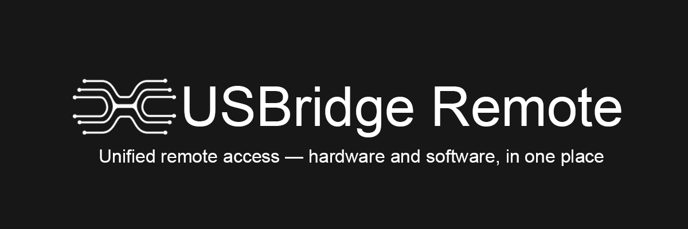
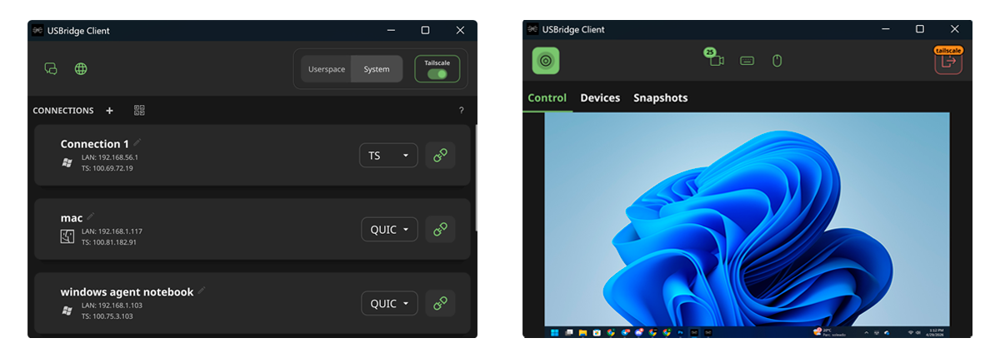
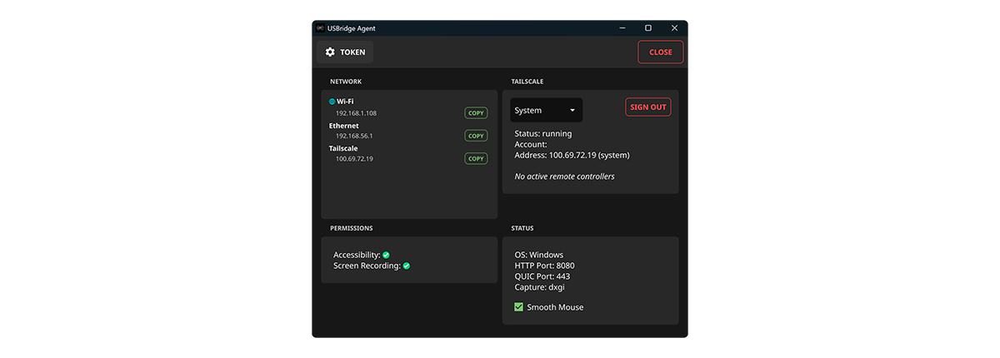

---
 
**USBridge Remote** is a unified client for managing remote machines — combining hardware-level BIOS access via USBridge KVM devices and software-based remote desktop in a single interface.
 
> ⚠️ **Beta Software** — This is an early release. Expect bugs. Please report issues via [GitHub Issues](https://github.com/USBridge/USBridge-Soft-Beta/issues) or join our [Discord](https://discord.com/invite/xqQ6ybkfWS) for support.
 
---

## Download
 
### Client — control your machines from here
 
| | Windows | macOS | Linux | Android |
|--|---------|-------|-------|---------|
| x64 | [Download .zip](#) | [Download .zip](#) | [Download .zip](#) | |
| ARM64 | | [Download .zip](#) | | [Download .apk](#) |
 
### Agent — install on the target machine
 
| | Windows | macOS | Linux |
|--|---------|-------|-------|
| x64 | [Download .zip](#) | [Download .zip](#) | 🚧 In development |
 
> No installer yet — just unzip and run.
 
---

## Features
 
**One place for everything** — manage USBridge KVM hardware devices and software agents from a single dashboard. Add a machine, connect, done.
 
**No limits, no subscriptions** — completely free. No session time limits, no connection limits, no account required on the target machine.
 
**Low-latency video** — adaptive streaming engine selects the most efficient protocol based on connection type. 2K resolution with minimal latency.
 

 
**Tailscale integration** — built-in encrypted P2P tunnel. Connect to any machine globally without port forwarding, VPN configs, or firewall rules. Works on LAN and over the internet automatically.
 

 
---

## How It Works

USBridge Remote operates in two modes:

**Hardware Mode** — connect via a physical USBridge KVM device. Gives you full bare-metal access: BIOS navigation over SSH, OS installation, recovery tasks. No software agent needed on the target machine.

**Software Mode** — install the agent on the target machine. Gives you high-performance remote desktop over an encrypted P2P tunnel (Tailscale/WireGuard). Works globally without complex firewall configuration.

A single dashboard shows all your assets — hardware and software nodes — in one place.

→ [Full setup guide with screenshots](SETUP.md)

---

## Community & Beta Testing

We're actively looking for beta testers.

Join our Discord to get the **Beta Tester** role, report bugs, and shape the roadmap:

**[discord.com/invite/xqQ6ybkfWS](https://discord.com/invite/xqQ6ybkfWS)**

---

## Links

- 🌐 [usbridge.io](https://usbridge.io)
- 🛒 [USBridge KVM 2.0 on Crowdsupply](https://crowdsupply.com/usbridge-technologies/usbridge-kvm-2-0)
- 💬 [Discord](https://discord.com/invite/xqQ6ybkfWS)
